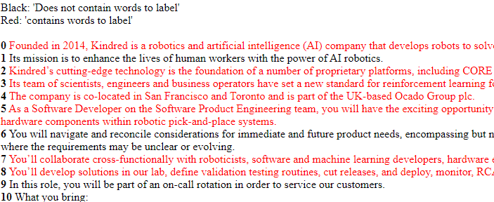
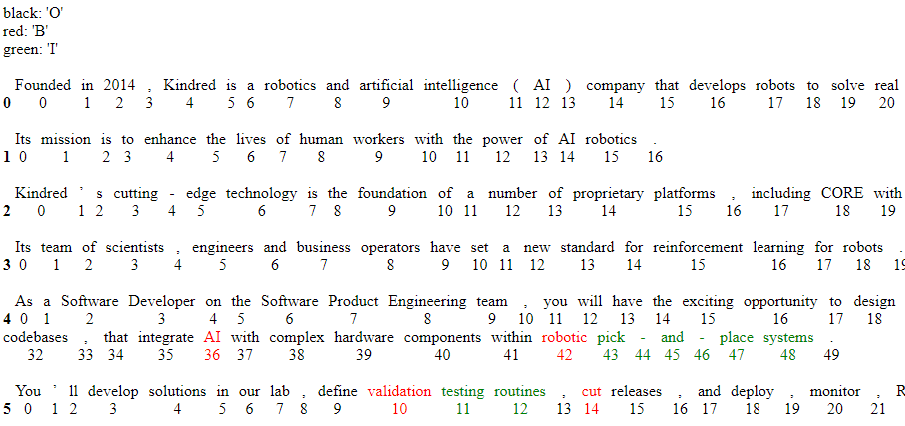

# Information on tools created to expedite labeling the training data:

Three functions--[predict_and_label](../career_fit_tools/training/labeling_helpers/predict_and_label), [autolabel](../career_fit_tools/training/labeling_helpers/autolabel), and [update_tokens_label](../career_fit_tools/training/labeling_helpers/annotation_guideline_helpers)--are used to expedite labeling training data. Note that, in all cases, the functions update the data that has been uploaded to the Jupyter Notebook you are using them in, they **do not** update the json files. This approach was taken so that if mistakes are made while annotating, or you want to test things, the files are not affected. For this reason, please make sure that you write the updated data to the json file's when finished, if you want to keep the changes that you made during a labeling session. 

## predict_and_label

This function accelerates labelling train/test/validation data by using the fact that, as the sentence and token classification models are progressively fine tuned, most of their predictions will be correct. The function uses this by taking a job description, and first feeding the sentences in the description to the sentence classifier. The sentence classifier predicts the appropriate labels, and each sentence is then output, color coded according to the label it was assigned (see below). Next, the program asks for a list of the sentences that were not labelled correctly. 

A human annotator indicates the sentences that are mislabeled. Now, all the sentences are labelled. Next, the same process is done to label the words in the sentence--the model makes predictions on the words, these predictions are indicated via color coding words according to label (see below), and a human annotator indicates which tokens are mislabeled. 

After the sentences in some number of descriptions are labelled using this approach, both models are fine tuned with the newly labelled data. The process then repeats--the models are used to predict labels on new job descriptions, and a human annotator corrects the incorrect predictions--but  now, because the model is more refined, less feedback from the human annotator is required. In the future, how much less work by the annotator will be benchmarked. See the notebook [training_labeling_interplay](../career_fit_tools/examples/training_labeling_interplay) for an example of this process.

## update_tokens_label

It has often been the case that during labeling, only a few labels in a job posting have to be changed. For example, this occurred as the annotation guidelines were refined, or when I began to try and extract labelled entities from the postings, and realized that the way I used the 'B' label was slightly incorrect. This function makes it easy to do just that. It works similarly to predict_and_label: the sentences/tokens are output, color coded according to their current label, and with numbers below them. The human annotator then can indicate which sentences/tokens should be labelled differently, and what their new label should be. The program then updates the appropriate labels in the data structure. An example of the function being used is demonstrated in the notebook [training_labeling_interplay](../career_fit_tools/examples/training_labeling_interplay).

## autolabel 

This function expedites labelling train/test/validation data for the sentence classification model by using the fact that sentences that contain certain words, or appear at a given place within a job description, are far more likely to be labelled a certain way. For example, nearly all sentences with the word "SQL" in it  should be labelled "this sentence contains words to extract from the job description". Similarly, the last few sentences of each job description typically should be labelled "does not contain words to extract from the job description", because often times they are legal statements, or other irrelevant information. The autolabel function uses these facts to expedite labelling, by allowing the user to indicate that they want to use either "keyword mode" or "first and last sentences mode".

-  keyword mode: The user enters a word, as well as a default label. All sentences in the dataset with that word are output to an html file. The user determines which of the sentences in the html file should be given the default label, indicates this to the program, and then those sentences are assigned that label. There is also an option to indicate only the sentences in the file that *should not* be assigned the default label, up to the number that the user looked through (if ten thousand sentences have "SQL" in them, the user might not want to look at every sentence in one sitting).
-  first and last sentences mode: This mode works like keyword mode, except that the user inputs a percentage and a default label. The program outputs the first N% and last N% of each job to to a html file, and then the user indicates which of the sentences should/should not be assigned the default label. 

Two things to consider:

- These were used to create a more balanced dataset--if you only use "predict_and_label", because most of the sentences in the description do not contain words to annotate, the sentence classification data will be unbalanced.
- The "keyword mode" of the "auto_label" function will likely lead to overfitting the keywords used, if you aren't careful. Future work involves using a part-of-speech tagger and data augmentation to mitigate this. The idea is that, if more data was created from all of the sentences that were labelled "has word to extract" due to having "SQL" in them, by replacing all of the proper nouns with proper nouns from another field, this would force the model to associate the structure of the sentence with the label, instead of the word "SQL". 

Please see the notebook [preliminary_fine_tune](../career_fit_tools/examples/preliminary_fine_tune.ipynb) for an example of how this function is used.

